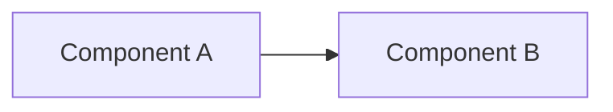

# TDD — {{titulo}}

## 1 Resumo tecnico

<!-- <= 5 linhas: solucao proposta, escopo tecnico, impacto. -->

## 2 PRD relacionado / contexto

<!-- Link relativo ao PRD de mesmo slug, se existir: `../prd/<arquivo>.md`. -->

## 3 Objetivos tecnicos e escopo

<!-- O que sera construido, modificado ou removido. Delimitar claramente o escopo. -->

## 4 Arquitetura proposta

<!-- Diagrama Mermaid OBRIGATORIO. Adicione contexto textual complementar abaixo do diagrama. -->

## 5 Modelo de dados

<!-- Esquema de entidades, tabelas, coleções, eventos — conforme aplicavel. -->

## 6 APIs / contratos / eventos

<!-- Endpoints, schemas de request/response, payloads de eventos SNS/SQS. -->

## 7 Alternativas consideradas

| Opcao | Pros | Contras | Decisao |
|-------|------|---------|---------|
|       |      |         |         |

## 8 Impactos

### Seguranca

<!-- Autenticacao, autorizacao, segredos, superficies de ataque. -->

### Performance

<!-- Latencia, throughput, cache, índices. -->

### Observabilidade

<!-- Logs, metricas, tracing, alertas. -->

### Migracao

<!-- Passos de migracao de dados/schema, janela de manutencao, rollback. -->

## 9 Plano de testes

<!-- Estrategia: unit / integracao / contrato / e2e; thresholds de cobertura. -->

## 10 Rollout / rollback

<!-- Feature flags, percentual gradual, gate de metricas, procedimento de rollback. -->

## 11 Riscos tecnicos

<!-- Incertezas, débitos técnicos introduzidos, POCs necessarios. -->

## 12 Tarefas derivadas

<!-- Tasks geradas a partir deste TDD (links relativos). Se nenhuma ainda: pendente. -->
