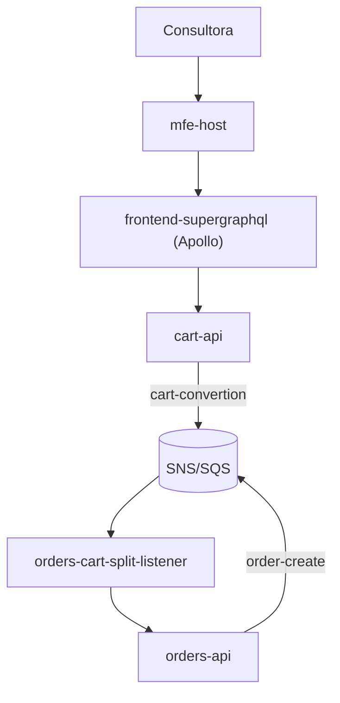
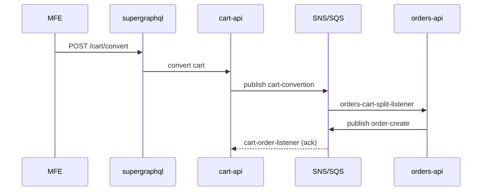
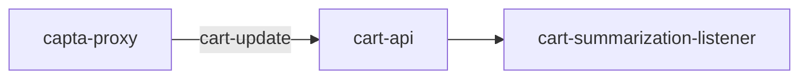

# Diagramas Mermaid para Apresentacoes

Skill autocontida (nao depende de outras skills). Escolha o tipo de diagrama conforme a intencao e gere um bloco ```mermaid valido. Se o ambiente nao renderizar Mermaid, use o fallback textual ao final.

## Escolha do tipo

| Intencao | Tipo Mermaid |
|---|---|
| Estrutura / componentes / dependencias | `flowchart` |
| Interacao temporal entre servicos/atores | `sequenceDiagram` |
| Fluxo de evento/dados ponta a ponta | `flowchart LR` |

## Regras de sintaxe (evitam erro de parse)

- IDs de no sem espaco: use camelCase ou underscore (`ordersApi`, `cart_api`). Nunca `orders api`.
- Rotulos com caracteres especiais entre aspas: `A["Process (main)"]`, `B["Step 1: Init"]`.
- Rotulos de aresta com parenteses entre aspas: `A -->|"O(1) lookup"| B`.
- Nao use palavras reservadas como ID (`end`, `graph`, `subgraph`). Use `endNode`.
- Subgraph com ID explicito: `subgraph auth [Authentication Flow]`.
- Nao use angle brackets nem cores/estilos explicitos; deixe o tema padrao.

## Template — arquitetura (flowchart)



## Template — sequencia (fluxo de pedido)



## Template — fluxo de dados/evento (LR)



## Boas praticas para o GSP

- Marque produtor e consumidor de evento com rotulo de aresta = valor string do `typeMessages` (ex.: `"order-create"`).
- Use `[(DB)]` para bancos (PostgreSQL/Oracle/ScyllaDB/Redis) e `[(SNS/SQS)]` para o barramento.
- Mantenha o diagrama focado no alvo apresentado (sistema, torre ou projeto); nao desenhe o sistema inteiro para um projeto especifico.
- Inclua apenas elementos `[documentado]`; nao invente componentes para completar o desenho.

## Fallback textual (quando Mermaid nao renderiza)

Se o diagrama nao puder ser renderizado, entregue a mesma informacao como lista de nos e arestas:

```text
Nos: Consultora, mfe-host, supergraphql, cart-api, SNS/SQS, orders-api
Arestas:
  Consultora -> mfe-host
  mfe-host -> supergraphql
  supergraphql -> cart-api
  cart-api -> SNS/SQS  [cart-convertion]
  SNS/SQS -> orders-api (via orders-cart-split-listener)
  orders-api -> SNS/SQS  [order-create]
```

A apresentacao nunca deve falhar por ausencia de diagrama: na pior hipotese, descreva o fluxo em texto.
